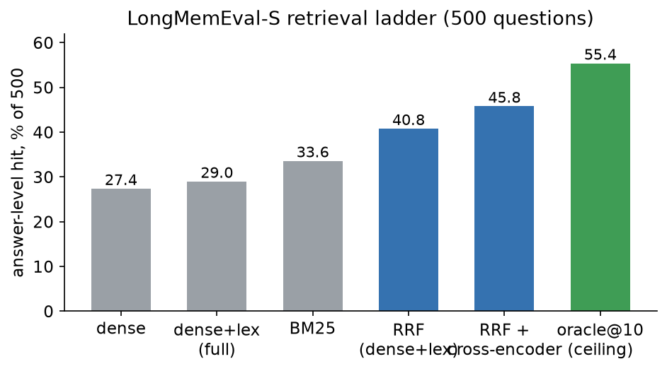
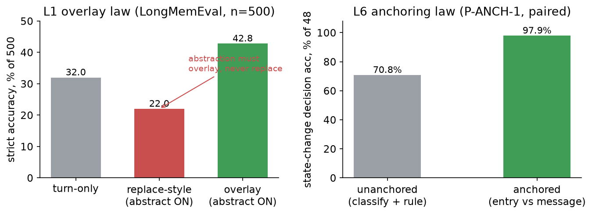
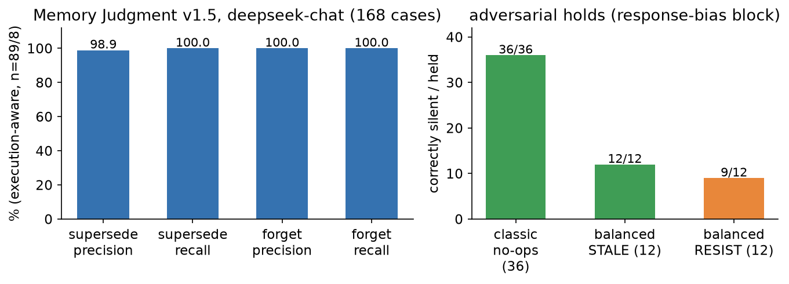
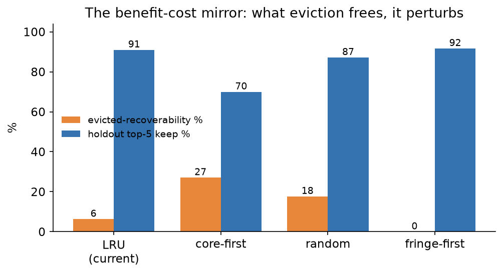
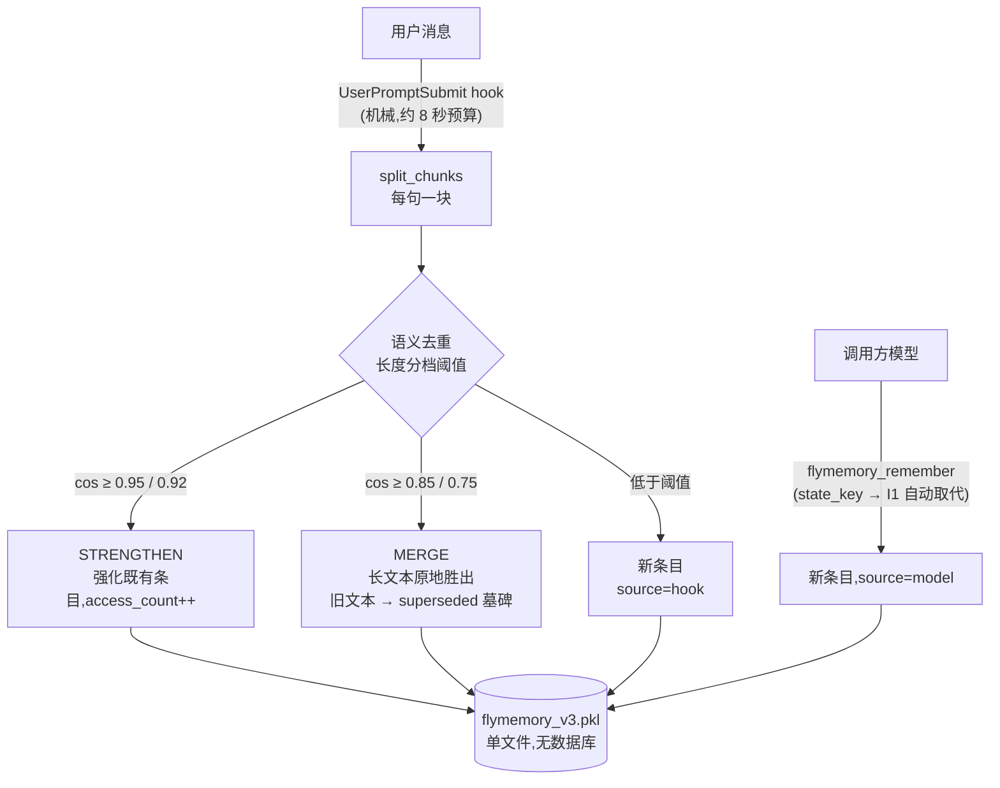
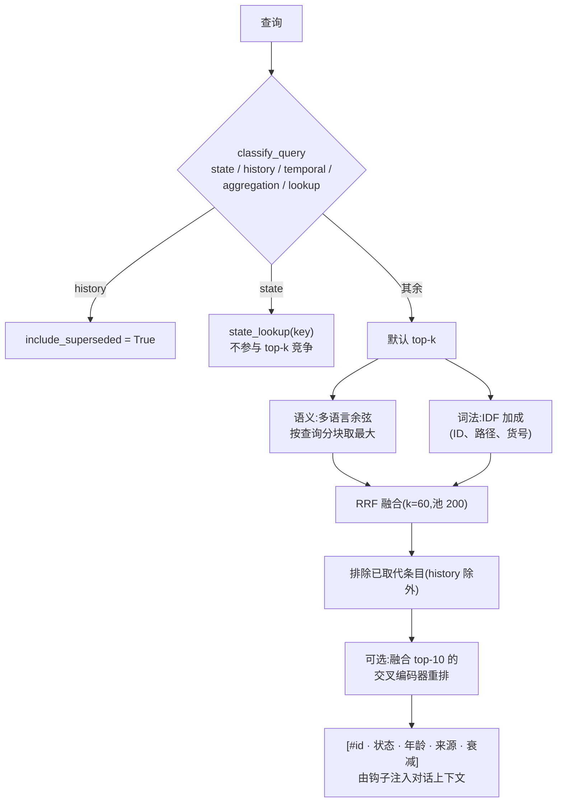
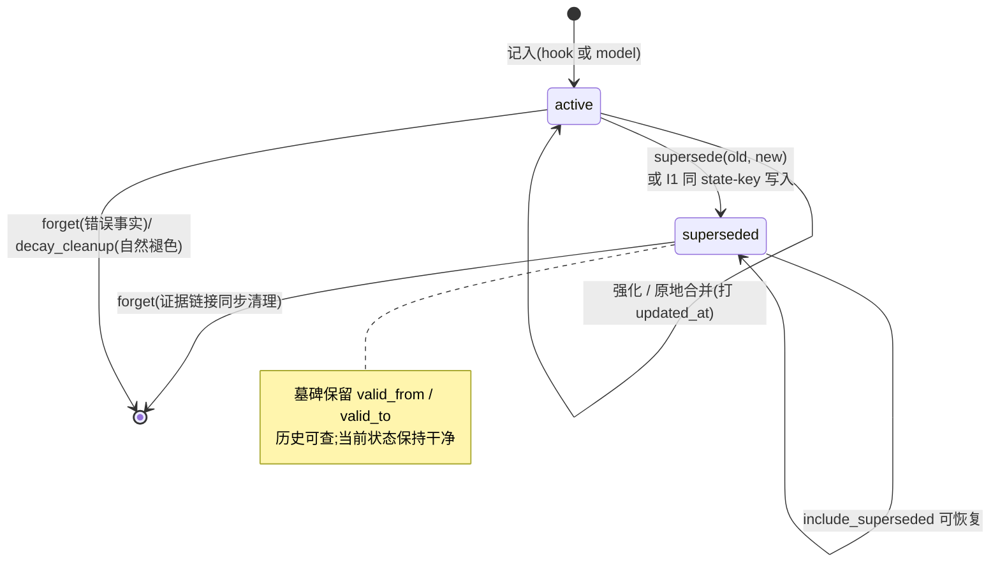

# FlyMemory

[English](README.md) | **简体中文**

*最后更新:2026-10-03 · v4.0 — 通俗介绍、结果图表、聚合协议、dream(空闲时整合)已改为定时静默运行*

**给个人 AI 智能体用的长期记忆层:混合检索(语义 + 词法 → RRF 融合,可选交叉编码器重排)+ 记忆状态机(supersede 谱系、带证据链的整合、幂律衰减、排练、定向遗忘)+ 由调用方模型驱动的判断 —— 服务器维护状态,调用方模型做决策。**

FlyMemory 给编码智能体一个持久、自管理的记忆:你的每条消息由钩子自动捕获,按句切分入库、去重,并在之后的对话中把相关记忆注入回来——带时间戳和出处。过时的事实不会被删除,而是由调用方模型标记为 *superseded(已被取代)*:历史随时可查,当前状态保持干净。

## 大白话版(一分钟)

**它解决什么问题?** AI 助手在对话之间会全部忘光。FlyMemory 给它一个能留存的笔记本:你说的每句话自动记一行,下次开新对话时,相关笔记自动递回给 AI——带时间戳和出处。

**怎么工作的(打个比方)?** 想象一本管理得极好的纸质笔记本:

- 你说的每句话单独记一行(一个话题不会糊成一团);
- 你重复说一件类似的事,笔记本只在旧行下面划一道线(加重),不会抄两遍;
- 你**纠正**一件事("其实我搬到杭州了"),旧行被划掉——但没撕掉,问历史时还能翻到;
- 每隔一阵,零散的短句被蒸馏成干净的摘要笔记;
- 几个月没人碰的笔记慢慢褪色(不会突然消失);
- 找笔记双管齐下:按**意思**找(换个说法也能找到)+ 按**关键词**找(货号、路径、ID 这种精确串)。

**谁负责动脑子?** 笔记本自己从不思考。一个小机械程序只管记录和取回;所有判断——什么重要、什么过时、什么该忘——都由你正在用的 AI 通过几个工具完成(`flymemory_remember`、`flymemory_supersede`、`flymemory_forget` 等)。"存储傻瓜化、判断可追责",这是整个设计的核心赌注,下面的每个基准都是为了让它接受检验。

**需要读研究章节吗?** 不需要。到 [安装](#安装) 为止就够用了。后面是实测证据:基准、消融,以及一长串"试过但没用"的东西(故意保留——负结果也是记录的一部分)。

**阅读地图** — 想*直接用* → [安装](#安装)。想*知道好不好用* → [结果一览](#结果一览)和各基准节。想*知道哪些路走通了* → 全部。想知道*哪些路没走通* → 标了 measured negative 的段落。想*看研究定律* → 定律账本在 [`research/RESEARCH.md`](research/RESEARCH.md)。

> 名字由来:v1 是纯 Hopfield 联想记忆,灵感来自果蝇蘑菇体(保留在下方 [v1/v2](#v1v2-hopfield-实验) 节)。v3 的生产检索路径是语义+词法检索;Hopfield 矩阵只作为*实验性*联想扩展层保留,实测(见 [基准](#基准-1))不支持启用它。

## 结果一览

下面每个数字都可以一条命令复现,工件路径在对应章节。四张图概括实测故事;负结果与正结果同样承重。



*9,729 条的 LongMemEval-S oracle 库上的检索表现。混合融合(RRF)和交叉编码器各买到真实的分数;词法通道承载的是货号和 ID——嵌入看不见的东西。*



*左:L1 叠加定律——整合必须叠加,绝不替换;替换式摘要比"什么都不存"还差 10 分。右:L6 锚定定律——同样 48 条语句走两种收集策略;锚定判断近乎机械(预注册配对实验,不一致对 13:0,McNemar p ≈ 2e-4)。*



*调用方模型真的会"操作"这台状态机吗?168 例判断基准,执行感知计分。平衡块测响应偏置:真变化从不漏(12/12),未确认的意图偶尔误改(9/12)——偏差方向是过度急切,不是过度保守。*



*生产库上的存储策略:驱逐释放了什么,就扰动什么。高覆盖条目既是冗余区(容易被恢复:橙)又是检索枢纽(排序稳定性:蓝)。LRU 赢下这一对;冗余红利早被上游去重收割了。*

## 工作原理

```text
用户消息
   ↓  UserPromptSubmit hook(机械:捕获 + 召回 + 存储)
分块存储:每句一块(多话题消息不糊团)
   ↓
语义去重,按长度分档阈值
   > 0.95(短)/ 0.92(长) → 强化既有条目
   > 0.85(短)/ 0.75(长) → 合并(长文本胜出;V4:旧文本成为带
                              valid_from/valid_to 的 superseded 墓碑,
                              当前条目打 updated_at)
   否则                     → 新条目(source=hook)
   ↓
模型精存:调用方把认为重要的结论经 flymemory_remember 存储
   (source=model;可选 state_key/state_value —— I1 唯一活跃:同 key
   自动取代旧状态)

召回(每次查询):
   查询类型路由(V4):state / history / temporal / aggregation /
   lookup —— history 类自动包含已取代条目;state 类可经
   state_lookup(key) 直接回答,不参与 top-k 竞争
   语义排序:多语言嵌入余弦,按查询分块取最大
 + 词法排序:IDF 加成(货号、路径、ID —— 嵌入看不见的东西)
        ↓ RRF 融合(k=60,池 200)→ 候选顺序
 - 已取代条目被排除(history 查询用 include_superseded=True)
 可选:对融合 top-10 做交叉编码器重排(enable_rerank=True)

衰减 R(t) = (1 + t/τ)^-0.5 是维护信号(驱动清理和排练),不是排序
特征——按它排序实测输给纯 RRF(见下文 LongMemEval 与 state-aware 节)。

空闲整合("做梦",每小时任务):
   RECENT 窗口(90 分钟)→ LLM 蒸馏 → 逐条忠实性审计
   → 经 flymemory_remember 叠加入库(支持 compartment 分区)
   ——见 dream.py 与 v4-rfc.md §9
```

### 写入路径全景



### 召回路径



### 一条记忆的生命周期



管线有一条硬规则:**服务器永远不跑 LLM**。一切语义决策——整合什么、事实是否过时、什么值得忘——属于调用方模型;它看到 id、年龄和出处,通过 MCP 工具驱动状态机。服务器拥有全部机械部分:分块、去重、融合、衰减数学、谱系卫生(forget 与衰减清理时同步清理证据链接),以及持久化。

**衰减是幂律,不是指数半衰期**:R(τ) ≈ 0.707,真半衰期是 3τ(默认 τ=30 天时为 90 天)。重尾是有意的——旧记忆缓慢变淡,而不是突然消失。

**为什么语义整合不设阈值**:在多语言嵌入器上,真正的同义改写对可能只有 0.62,而仅差一个细节的相同结构对("明天 15:00 开会" vs "今天")能到 0.93。没有阈值能合并前者而不合并后者,所以近乎相同的去重是自动的,而*意义层面*的整合交给调用方模型经 `flymemory_supersede(old_id, new_id)` 完成——判断放在判断能力所在的地方。

## MCP 服务器 + 钩子(让一切"开箱即用"的集成)

服务器以持久无状态 streamable-HTTP MCP 服务运行,重启从不断开已连接的会话:

```bash
python flymemory/mcp_v3.py --http        # 服务于 http://127.0.0.1:8765/mcp
```

MCP 注册(ZCode `~/.zcode/cli/config.json`,路径自行调整):

```json
{
  "mcp": {
    "servers": {
      "flymemory": {
        "type": "http",
        "url": "http://127.0.0.1:8765/mcp",
        "timeoutMs": 120000
      }
    }
  }
}
```

`UserPromptSubmit` 钩子把每条用户消息转发给服务器并把召回结果注回对话——捕获不依赖模型记得去调工具:

```json
{
  "hooks": {
    "enabled": true,
    "events": {
      "UserPromptSubmit": [
        { "hooks": [ { "type": "process",
          "command": "C:/path/to/python.exe",
          "args": ["D:/path/to/flymemory/flymemory/hook_auto.py"],
          "timeoutMs": 10000 } ] }
      ]
    }
  }
}
```

`flymemory/flymemory_supervisor.pyw` 守护服务器(崩溃即重启,健康时空转,永不退出);登录时以无窗口方式运行——启动文件夹快捷方式或计划任务均可。

## LongMemEval-oracle 检索基准

`bench_longmemeval.py` 把 LongMemEval oracle 版(500 题、940 个证据 haystack 会话、10,866 turns、2021-2024)适配到 FlyMemory:全部会话按 turn 粒度注入同一个共享记忆,问题由召回回答,按证据会话 hit@3 计分(检索层指标;不含答案生成与 LLM 评判)。

| 策略 | evidence-hit@3 |
|---|---|
| **RRF 融合 —— 生产召回路径** | **339/500 = 67.8%** |
| **RRF + 交叉编码器重排(可选)** | **360/500 = 72.0%** |
| 仅 BM25(IDF 词法) | 314/500 = 63% |
| 旧版全打分(sim × decay × source *排序* —— 已退役,见下) | 303/500 = 61% |
| 仅新近度(最新 turns) | 1/500 = 0%(日期跨 3 年——新近度在这里无信息量) |

加粗行是当前生产路径(`recall()` = 语义与词法排序的 RRF 融合;重排可选)。"legacy full" 行是该基准最初测的原 eff 排序管线,为连续性保留——后来实测按 decay × source 排序*输给*纯 RRF(见下文"衰减与来源权重在哪起作用"),所以不再是出厂排序。

分能力(旧路径,保留作分型明细):knowledge-update **83%**(supersede/谱系的强项),single-session-assistant 98%,multi-session 56%,single-session-user 54%,temporal-reasoning 44%,single-session-preference 40%。

诚实的解读:在*已退役*的 eff 排序路径上,纯 BM25 与管线统计打平(63% vs 61%)——闲聊式会话上精确词面重叠承载了大部分检索权重。出厂的 RRF 融合修复了这一点:67.8% 对 BM25 的 63%(+4.8pp),交叉编码器重排再 +4.2pp。多语言嵌入器在英文闲聊文本上的收益仍不如中文技术内容,但混合路径已不再依赖这个差距。n=500,仅检索、无 LLM 层:指示性结果,与已发表的 LongMemEval 端到端分数(含回答 LLM)不可比。

## 交叉编码器重排

`bench_rerank.py` 用交叉编码器(`ms-marco-MiniLM-L-6-v2`)给融合后的 RRF top-10 打分并返回重排后的 top-3。在上述 oracle 版(500 题、9,729 条)上:

| 策略 | evidence-hit@3 |
|---|---|
| RRF 融合 top-3(无重排) | 338/500 = 67.6% |
| **RRF top-10 交叉编码器重排** | **360/500 = 72.0%** |
| oracle:答案在 RRF top-10 内任意位置 | 397/500 = 79.4% |

重排把 top-10 天花板的约三分之一转化为 top-3 命中(+4.4pp);它也可能把原始 RRF 曾浮出的答案排掉——oracle 行展示的是完美的池级修复的价值。按库启用:

```python
mem = SmartMemory(enable_rerank=True, rerank_pool=10)
```

默认关闭:pool=10 时一次 CE 前向约 0.3 秒 CPU。重排器惰性加载、从不持久化。已取代条目在池化*之前*就被排除——死条目不会烧掉重排名额。

增益迁移到生产规模。`bench_rerank_full.py` 在 S 版库上(500 题,**199,509 条 turn 粒度条目**):

| 策略 | evidence-hit@3 |
|---|---|
| dense(按块最大余弦) | 137/500 = 27.4% |
| 完整生产打分(sims × decay × source) | 145/500 = 29.0% |
| 仅 BM25(IDF 词法) | 168/500 = 33.6% |
| RRF 融合 top-3 | 204/500 = 40.8% |
| **RRF top-10 交叉编码器重排** | **229/500 = 45.8%** |
| oracle:答案在 RRF top-10 内任意位置 | 277/500 = 55.4% |

同样的 +5.0pp 重排增益,同样约 1/3 的天花板捕获——效应在 20 倍库容变化下稳定。本 run 的两条取证注记:更早的"production scoring = 0/500"是**基准伪影**(S 版日期解析器对每个会话静默返回 None,全部衰减权重变 NaN;已在 `parse_lme_date` + `repair_lme_s_timestamps.py` 修复),且 `bench_lex_ab.py` 显示词法通道的 ratio 归一化与累计 IDF 在 RRF 内是**平手**(339=339/500)——`_lex_scores` 无需改动。线程上限注:在跑满核训练任务的主机上,torch 默认线程数会让 CE 前向活锁(220 秒+ 对比限 1-4 线程的 0.3 秒);bench 与重排器自身都已限线程。

### 衰减与来源权重在哪起作用?不在融合之后。

`recall()` 按原始语义与词法通道的 RRF 排序;decay × source × eff 分数是辅助列,不是排序键。用 eff 重排融合池反而*更差* —— `bench_state_oracle.py`(oracle 版,500 题):

| 策略 | evidence-hit@3 |
|---|---|
| RRF top-3(生产顺序) | 339/500 = 67.8% |
| RRF top-10 按 eff 重排 | 335/500 = 67.0% |
| RRF top-20 按 eff 重排 | 329/500 = 65.8% |

eff 分数是*维护*信号(谁在衰减清理中存活、排练刷新碰谁),不是排序信号:把它应用到已融合的候选池上,是用检索质量换新近偏差。同一 eff 排序跑在全库上就是上文的 "full" 臂——在 S 规模上输给纯 RRF 约 12pp。生产召回因此保持 RRF 顺序,`bench_rerank_full.py` 保留 state10/state20 臂作为该决策的常驻回归哨兵。S 版抽查(前 150 题,饱和主机上):rrf 21.3%、state10 22.0%、state20 20.7% —— 与纯 RRF 在噪声内,池规模变化下排序不变。

有些问题需要不止一次检索。这一节测的是:允许助手带时间过滤反复搜索时,会发生什么。

## 记忆判断基准(Phase 1)

检索指标回答"证据能不能找到";它们对"摆在状态机面前的 LLM 会不会*正确操作*它"只字未提。`bench_memory_judgment.py` 测的正是这件事,用离线 JSON 协议(actor 看到记忆快照 + 新用户消息,输出严格 JSON;harness 代执行并校验)。基准存在期间引擎冻结。机械有效性(id 存在、supersede 目标活跃)由代码检查;整合结论的无支撑推断交给 LLM 裁判。

数据集 v1.5(168 例,五批):62 个 supersede(14 个来自矛盾场景 + 20 个来自状态保真对 + 28 个新主题),30 个对抗 no-op("我修了一下旧 Windows VM"绝不能取代 Fedora 条目),14 个整合(对话片段的总结请求;2 个带过时干扰项测 stale 泄漏),8 个 forget(6 个错误事实删除 + 2 个陷阱——正确动作是 supersede,绝不该 forget),第 4 批新增四个能力维度(各 5 例):multi-update(两个旧状态都需取代)、reversal(值回退——必须建新条目,绝不复活已取代者)、temporary state(限时事实是新信息而非更新)、partial correction(复合条目改一个字段)。生成器:gen_dataset_batch2.py / batch3.py / batch4.py。

第 5 批加入**平衡 stale/新检测**(12 + 12 例),借自 intuition-mechanism P32-h 与 STALE 基准的 Premise Resistance 轴:STALE 半边事实真的变了(正确 = supersede 到新值);RESIST 半边事实未变,用户消息只是嵌入了旧前提或未确认的切换意图("我在考虑切回 Notion")。平衡设计测的是响应偏置——过度保守(漏掉真变化)vs 过度急切(听说话就改)——单侧 P/R 看不见这个。

首批结果,2026-09-24(oracle = 金标回放,harness 健全性检查,全 1.0 零机械错误;actor = `deepseek-chat`,温度 0;supersede/forget 分数是执行感知的——决定了但没执行成功的操作不改变状态,不能计为命中):

| 指标 | 值 |
|---|---|
| supersede precision / recall | **1.00 / 1.00**(n=77,含 multi-update/reversal/partial-correction 维度) |
| forget precision / recall | **1.00 / 1.00**(n=8) |
| 不必要变更率 | **0/36**(全部对抗 no-op 保持沉默) |
| 整合证据精确匹配 | 8/14 |
| 无支撑推断 0/14;stale 泄漏 1/14(LLM 裁判,已知的 cons_08 案例——裁判校准:2 个蒸馏会话人工验证忠实) |

值得保留的失败模式:(1)一次 supersede 发出了,但要求的携带新状态的 `remember` 条目缺失——状态转换理解了,协议契约没守住;(2)一次整合把已取代的细节(旧打印机墨盒)写进"当前状态"总结——对证据忠实,但这是向"当前状态"摘要的 stale 泄漏;无支撑推断裁判抓不到这个,它是独立轴。此规模上 oracle 与自主的对比显示 **supersede 和 forget 的判断差距为零**;差距集中在整合时机与证据选择——下一迭代的目标。

v1.5 重跑(2026-09-28,168 例):supersede **0.99 / 1.00**,经典 no-op 不必要变更 0/36,第 5 批平衡块 **STALE 12/12**(真变化从不漏——零保守偏差)vs **RESIST 9/12**。三个 RESIST 失败分成两种行为:一次真正的 Premise-Resistance 破防("我要切回 VS Code"直接取代了 Zed 条目——未确认的意图被当成状态变更),两次边界 remember——状态正确未动,但把*考虑本身*存成了新条目("用户在考虑切回 pour-over")——可以说为真,但在严格 no-op 金标下是噪音。偏差方向是过度急切,不是保守(对照:P32-h 式设置下基于 doubao 的裁判 NEW 只报 7/40);集中在意图陈述上,且模型自己的理由显示它*有*"考虑 vs 已确认"的区分,却仍然 2/12 次写入。

**Arm-S 移植(负结果,2026-09-28)**:intuition-mechanism P32-i 表明其新颖性缺陷是提取失败——供给线索提取程序把盲评裁判从 20/40 提到 39/40。两步协议(`--two-step`:决定前强制断言提取并标注 fact/intent/question,`ACTOR_SYSTEM_TWO`)作为预注册臂移植至此。判定:NOT SUPPORTED——被标记的意图取代(bal_resist_01)依然发生,因为模型把"我要切回 X"标为 `fact`,即失败在分类裁量,不在提取;RESIST 变更 3 → 4(bal_resist_08 修复,bal_resist_11/12 新写了协议文本本身允许的考虑条目),一个经典 no-op 新增变更(0/36 → 1/36),一例 supersede recall 滑落(sup_06),整合时机在 3 例上漂移。supersede R 总体 1.00 → 0.989。移植失败本身有信息量:P32-i 的程序有效是因为其充分统计量客观(与 6/20/70 的数值比较加符号翻转);本 schema(fact/intent/question)没有可比的机械充分统计量——什么算更新、什么值得保留,目前是语义裁量。这是关于这一个 schema 的陈述,不是"判断不可能分解为客观子问题"的证明;寻找这种分解(断言提取 / 状态变化检测 / 记忆价值,分别建基准)是下一阶段。判断真的住在调用方,不能靠流程脚手架恢复。flag 作为回归哨兵保留,不进生产 prompt。

**原子分解(`bench_atomic_judgment.py`,2026-09-28)**:把单体记忆策略 prompt 拆成三个原语,分别独立建基准,各有独立 system prompt 与金标:

| 原语 | 输入 → 输出 | 分数 | 混淆 |
|---|---|---|---|
| A 断言提取 | turn → kind(fact/intent/question) | **81.2%**(26/32) | 全部错误偏向 fact(1/5 意图,5/7 问句) |
| B 状态变化检测 | (条目, 断言) → CHANGED/UNCHANGED/UNKNOWN | **100%**(30/30) | 无 |
| C 记忆价值 | (断言, 上下文) → KEEP/DISCARD/EPHEMERAL | **86.7%**(26/30) | 4 个一次性事件 → EPHEMERAL(无害) |

分解以少见的清晰度定位了端到端失败:**给定锚点**(一个可比较的具体存储值),状态变化检测完全可解——导致 Arm-S 失败的三条"考虑切回"断言在这里全部判为 UNCHANGED。感觉无解的部分是 A:对裸语言行为(声明 vs 考虑 vs 提问)做无锚分类,所有混淆都流向 fact。Round-9 评审的框架成立:瓶颈已从记忆管理收窄到语义边界检测,在其中,又从"无充分统计量"收窄到"**无锚点**——缺的是用来对比的东西"。下一步待验证的工程处方:对每条存储条目直接问 B 问题(锚定、近乎机械),而不是让模型先对 turn 自由分类。

该处方随后作为**预注册配对实验**检验(P-ANCH-1,`bench_anchor_pairing.py`;判据先于运行提交——279e9aa):同样 48 条语句、两种条件、一个因变量(这条消息是否使已存状态失效?)。

| 条件 | 输入 | 准确率 |
|---|---|---|
| U 无锚(分类 + 朴素规则) | 仅 turn | 34/48 = 70.8%(结构上限 75%) |
| A 锚定 | (存储条目, turn) | **47/48 = 97.9%** |

U 的错误精确落在预测位置:12 个"旧物件事实"全部成为结构性误报,外加 2 个 resist;不一致对 13:0 倒向锚定(精确 McNemar p ≈ 2e-4)。唯一的锚定失误是"我要切回 VS Code"——预先声明的声明式意图残余,即标注边界分歧,不是锚定失败。预注册判定:**SUPPORTED-with-scope**。L6 在纲领文档中从候选升级为 established(单模型范围)。

**P-PHASE-1(`bench_phase_boundary.py`)**接着问锚定优势在何处退化,借 P47 的相边界方法:同一锚定判定在文本距离阶梯上(数字互换 / 改写 / 换域更新,加近碰撞干扰项)。结果:36/36——每一级都满分 6/6,即使消息在主题上比锚点更接近干扰项也零误报。测试范围内无相边界;L4 的小编辑脆弱性(引擎去重丢 5/20 个数字/日期编辑)在判断层不复现——问题是锚定且二元时,模型对值互换的读出完美。L4 保持机制层;L6 的锚点把梯度压平到 delta_emb ≈ 0.2。按预注册判定:P1 PARTIAL / P2 NEGATIVE(差距 0 < 15pp 带;无 FP 集中)。

**Phase 1.5(真实工具调用,`bench_memory_judgment_tools.py`)**把同样 38 例放进真实工具面——模型必须自理 id 流转(先 remember,拿回 id,再 supersede)。同模型同数据,执行感知计分:supersede **1.00 / 0.81**,forget 1.00 / 1.00,不必要变更 0/10。召回差距是 3 例:模型对新状态的 `remember` 被**合并进旧条目**(sim > 0.75,长文本胜出:条目文本被原地改写为新状态)——模型随后发出的冗余 supersede(旧 == 新)被正确拒绝。三例重放显示最终库状态全部正确:合并*就是*状态转换。严格 P/R 因此少计;诚实的说法是 2/16 个 supersede 需要显式 supersede 工具,3/16 被合并语义吸收,且模型无法从工具返回文本分辨"存为新 #N"与"强化/合并进既有 #N"——这一层发现的唯一真实协议缺口。

**Phase 2(端到端,五臂,`bench_e2e_answer.py`)**:同样 30 个状态案例,按**答案层**计分——应用维护策略,检索,`deepseek-chat` 从召回条目作答,LLM 裁判分级。各臂把检索质量与状态维护分开:

| 臂 | 检索 | 维护 | current | stale | unknown(正确) |
|---|---|---|---|---|---|
| 无记忆 | – | – | 0% | 0% | 28/30(93%) |
| dense 朴素 RAG | cosine top-3 | 只存不维护 | 26/30 = 87% | **4/30 = 13%** | 0 |
| RRF 朴素(只存不维护) | 生产 RRF | 只存不维护 | 25/30 = 83% | **5/30 = 17%** | 0 |
| FlyMemory + oracle 状态 | 生产 RRF | 金标操作 | 26/30 = 87% | **0%** | 4/30 = 13% |
| FlyMemory + 自主状态 | 生产 RRF | DeepSeek 操作 | 26/30 = 87% | **0%** | 4/30 = 13% |

5 个朴素 RAG 的 stale 恰好是被删除错误事实的案例(frt_01–04):没有 `forget`,助手继续自信地用用户明确撤回的事实作答。自主臂精确追平 oracle 天花板——端到端判断差距为零——动机性状态机的 stale 污染在它之下完全消失。裁判校准:150 个臂-答案对上 LLM 判定与机械关键词检查全部一致(150/150)——裁判既不更严也不更松。

无记忆臂注:盲模型 3% current、10% stale、20% 彻底错——该弃答时编造。朴素存储达到 83-87% current 但仍漏 17% stale;只有状态维护臂在 87% 天花板上做到 0% stale。

有些问题需要不止一次检索。这一节测的是:允许助手带时间过滤反复搜索时,会发生什么。

### TOOL2:时间范围 agentic 检索(56% strict)

`bench_toolanswer.py --tool2`(TOOL2):答题模型的 search_memory 增加 `time_range` 参数("YYYY-MM..YYYY-MM"),system prompt 指示对时间限定问题做范围检索。同样 50 题:

| 答题模式 | strict(n=50 / n=500) | 加权 |
|---|---|---|
| 单轮 top-5(三层) | 40.0% / 40.0% | 40.0% |
| TOOL1 agentic(自由搜索) | 46.0% / 43.2%* | 48.6%* |
| **TOOL2 agentic + time_range** | **56.0% / 44.6%** | **63.0% / 50.0%** |
| TOOL3 + 计算器(n=50) | 54.0% | 58.0% —— 无增益,弃用 |

(*TOOL1 只在 n=50 跑过;n=500 时 TOOL2 44.6% strict / 50.0% 加权,对比 turn-only 37.0% / 39.6% 与 prose overlay 42.8% / 44.9% —— agentic 时间范围检索在两个规模都是最优配置。n=500 分型:temporal-reasoning 仍是最弱切片 50/133;multi-session 56/133。)

预注册预测(research/RESEARCH.md,TOOL2)以大裕度确认:temporal-reasoning 错误降 67%,其他类型无一回退(strict 总体 +10pp)。时间范围检索是一阶杠杆,已作为默认工具形态发布。TOOL3 探针:再加计算器无进一步增益(54.0%,噪声内)——有时间范围检索后,残余瓶颈是证据收集(跨多条 turn 读取),不是算术。

跨模型检查(外审建议):同样 50 题由第二模型(GLM,经交互会话)作答,30% strict / 31% 加权,对 DeepSeek 的 32% / 35% ——检索证据上约 50% 的答案转化天花板是模型无关的,确认它是任务结构限制(多 turn 聚合),不是 DeepSeek 个性。评分脚本:bench_glm_answers.py。

`bench_lme_e2e.py` 把协议扩展到公开 LongMemEval-oracle 问题(全部 500):召回 top-5 → deepseek 作答 → 裁判对金标。**Strict 37.0%(185/500),含 partial 加权 39.6%。**全量归因:检索 hit@5 = 73.2%;证据命中时答案 43% 正确,未命中时 22%(这些是不需要特定证据也能答的——通用或可推断)。50 题样本上 top-k 提到 10 无变化。转化损失(命中后 43% 而非 100%)集中在多 turn 聚合问题(跨两条 turn 的算术、跨会话计数)——turn 粒度检索答不了它们,这正是会话级整合(下文)的具体论据。与官方 LongMemEval 端到端分数不可比:它们喂全量 haystack(long-context 设置),这是记忆增强 top-k 设置。

短笔记被誊成摘要时,原稿该扔吗?实测答案:绝不扔——都留着。替换式丢 10 分准确率;都留着多挣 6 分。

### 粒度 A/B:整合必须叠加(overlay),绝不替换

`bench_granularity.py` 把 940 个证据会话各蒸馏成 1-3 条 DeepSeek 整合的持久事实条目,同 50 题在两种入库策略下重跑:

| 库 | strict 正确 | 加权分 |
|---|---|---|
| 仅 turn 条目(基线,n=500) | 185/500 = 37.0% | 0.396 |
| 仅整合条目(replace,n=50) | 11/50 = 22% | 0.270 |
| **turn + 整合(overlay,n=500)** | **214/500 = 42.8%** | **0.449** |

用摘要替换原始 turn 会丢掉多数问题问的具体细节(22%——比基线还差)。把整合条目叠加到未动的 turns 上,全量 **+5.8pp strict**(在全部 500 题验证,非 50 题样本;逐题翻转:40 题改善 vs 11 题回退,净 +29)。摘要充当检索入口,turns 保留细节。这就是设计规则"原始条目永不删除——整合增加抽象而不损失"背后的测量。

全量幻觉审计(`bench_consolidation_audit.py`):703 个成功整合的会话逐一对源对话评判——首轮标记 5 个,头尾复查后 4 个仍标记(0.57-0.71% 会话级)。四个人工复核:2 个是裁判伪影(长对话 6000 字符截断;D&D 属性块细节和 40 万美元房贷确实在源里),1 个轻度过度推断(从一次修改请求推断"用户偏好抒情歌词"——裁判标记正确),1 个没有完整对话无法定论。修正后真实幻觉率:约 0-0.14%(703 中 0-1 个会话)。此可靠性水平下 LLM 整合条目可安全入库;审计裁判需要滑窗协议处理长对话。

### 引擎状态保真审计(发现并修复了一个真实的去重 bug)

`bench_state_fidelity.py` 把 20 个真实的单编辑状态更新("服务器是 192.168.1.50" → "…1.99"、"会议 15:00" → "…16:00")推过去重阶梯,检查库里最终是否持有新状态。修复前:**5/20 个更新被静默丢弃**——两个在 sim > 0.92 被强化(文本未动,只刷了访问时间),三个因新文本不比旧文本长而合并未改写。受影响的恰好是最常见的一类:改数字、时间、名字。修复(在 `remember()` 中):携带既有条目所缺 token 的重述,以及合并区任何不同文本,现在会原地改写条目——纯重述保持旧行为。修复后:20/20 更新以正确状态收尾;全部 51 条行为测试、矛盾基准(stale top-1 仍 0/14)和 QA 基准(前后均 17/20——三个 miss 是其既有基线)确认无回退。

已知权衡,V4 关闭:20 个更新中 6 个原地改写(merge)——V4 的改写式合并把旧文本停为带 valid_from/valid_to 的 superseded 墓碑,`include_superseded=True` 统一恢复历史(6/6 对验证)。成本:每次改写式合并 +1 条目。

查询路由(V4):`recall` 对每个问题分类(state / history / temporal / aggregation / lookup,机械启发式)并相应路由——history 类自动包含已取代条目;state 类可经 `state_lookup(key)` 直接回答,不参与 top-k。

端到端运行的另一个遗留:265 个 overlay 错误答案的全量归因——114 个证据 turn 在 top-5(无整合条目命中),53 个证据 turn 与整合条目都在仍然失败(答案侧多 turn 聚合),13 个只命中整合条目(摘要缺细节),85 个完全检索未中。按题型 temporal-reasoning 主导(106/265 错;该型 80%),multi-session 次之(92)。下一杠杆是 temporal/multi-session 问题的答案侧多 turn 聚合,以及 32 个缺失的 preference/user 检索质量。8 个抽样错误的复核确认机制:6/8 需要跨 turn 算术(会员时长相减、行程里程相加、航班计数),证据 turn 全在 top-5;模型答"不知道"因为没有单条陈述那个推导数字。具体 v4 杠杆是整合时产出结构化时间线(实体+日期表),或答题时的计算工具。85 个 full-miss 的 6 例复核显示其最佳证据在 rank 1708-11867、sim 0.18-0.64:聚合/统计问题("看过几次医生"、"礼物总花费"、"两个月前和 Rachel 做了什么")的答案横跨大量 turn——结构性超出 top-k 语义检索,确认它们需要聚合型条目或答案侧工具。

### 时间线 overlay:结构化形态胜出(v4 杠杆验证)

`bench_timeline.py` 用时间线形态的整合条目("YYYY-MM:带数字/人名的朴素事实",按时间排序)替代散文摘要重跑粒度 A/B——同样 50 题(seed 7):

| 库(n=50,seed 7) | strict 正确 | 加权分 |
|---|---|---|
| 仅 turn 条目 | 16/50 = 32% | 0.350 |
| 散文摘要 overlay | 19/50 = 38% | 0.400 |
| 时间线 overlay(50 题样本) | 22/50 = 44% | 0.440 |
| turn + 实体状态 overlay(同源记录) | 18/50 = 36% | 0.390 |
| turn + 时间线 + 散文(双 overlay) | 21/50 = 42% | 0.420 |

双 overlay(时间线+散文堆叠)没有胜过纯时间线:top-5 池有限,散文条目挤占名额却不帮时间线回答的时间问题。纯时间线是最优单配置;堆更多整合形态会稀释它。

(实体状态记录——"实体.属性 = 当前值(从旧值变更)"——同 940 会话生成:高于 turn-only,低于时间线。实测谱系:narrative(turns)→ 散文摘要 → 时间线(最优)→ key-value 记录。)

全量(n=500)时间线 overlay **41.6% strict / 43.9% 加权**,对 prose overlay 的 42.8% / 44.9% ——统计打平。诚实解读:50 题样本把时间线形态高估了约 2pp;全量存活的是 overlay 原则本身(任一整合形态都比 turn-only 高约 +4.6pp)。全部 940 会话的时间线缓存在 reports/timeline_entries.json。记忆形态塑造答案质量,但散文与时间线之间的形态选择是二阶的;一阶杠杆是"是否把整合叠加到 turns 之上"。

形态矩阵补全(同 50 题,seed 7):第四种形态——实体状态记录("实体.属性 = 当前值(从旧值变更)")——**36% strict / 39% 加权**,与 turn-only 统计不可分。解读:结构化时间线行保留日期+叙述事实(可检索),而重度压缩的 key-value 记录丢掉了嵌入器需要的上下文表面,检索与作答都不更好。整合形态现在是实测谱系:narrative(turns)→ 散文摘要 → 时间线 → key-value(实体状态),最优在时间线。

## 教训通道(同一个坑,绝不摔第二次)

反复犯的错有专用机制(P-LESSON)。踩坑教训存在独立的 `lessons` 分区,
且形态有硬规则:**必须以触发词开头**——即环境/工具名——因为纯文本相似
度无法把"X 场景的新任务"与"X 场景下别做 Y"连起来,而精确关键词可以。
捕获钩子在**每条消息**上固定注入 top-2 教训(叠加在正常召回之外),
教训永不挤占常规名额。登记一条教训:

```json
flymemory_remember(
  text="PowerShell/Git Bash:内联引号转义会坏——复杂命令写脚本文件",
  compartment="lessons", tags="lesson")
```

调用方规则:修复/环境类任务动手前先查
`flymemory_recall(compartment="lessons")`;修完的坑必须当场登记。
诚实边界:坑的**第一次**必然踩(教训尚不存在);读了教训也不保证
一定执行。

## 聚合协议(调用方侧,实验性)

对跨大量 turn 聚合的问题("多少次…"、"总共…"),单发 top-5 检索结构性收集不足(L5 aggregation-miss 家族),而只加宽池子修不好答案——答案层必须分解。实测协议(P-ANSWER + P-AUDIT,multi-session 集 strict 6% → 16%,门后 unsupported-claim 率 0/50):

1. **宽收集** — 生产召回 top-30(宽度胜过所有聪明收集器;turn-recall 0.384 → 0.683)。
2. **逐条提取** — 对每条,只问该条中与问题相关的原子事实,逐字复制(禁推断);无则跳过。这一步把不可行的跨 turn 聚合拆成可行的逐 turn 查找。
3. **归纳** — 只从原子事实清单作答;对已提取数字的算术是归纳步的工作。
4. **审计** — 相信答案前先做无支撑声明检查(答案对事实清单);门以 0/50 通过的正是这个审计。

这是调用方侧协议:服务器保持零 LLM。成本约每题 31 次短调用——显式路由(aggregation 类查询),绝不上每消息钩子路径。

FlyMemory 在各替代方案中的位置,以及它刻意拒绝做的事情。

## 设计定位

FlyMemory 是**显式、可检查的记忆状态机**——不是模型驱动的记忆合成器。每个状态转换都是机械且可审计的:`superseded_by` 谱系、`source` 出处、幂律衰减、定向遗忘、证据链接整合、上下文压缩后的恢复包。捕获是机械的(hook),判断是调用方的(精存、supersede、整合、遗忘)——服务器永不跑 LLM,一切都在一个小文件里可读。

这是与托管"记忆合成"方案(后台模型侧对原始聊天的整合,如 ChatGPT 的记忆)的刻意对照:那些在服务规模上优化合成质量;FlyMemory 为个人智能体优化**可检查性、可验证性与数据本地性**。原始条目永不删除——整合添加带 `evidence_ids` 回链的高阶条目(无损抽象),被取代的状态经 `include_superseded=True` 保持可查。

## 记忆规则

| 规则 | 机制 |
|---|---|
| 机械捕获一切 | hook → `flymemory_auto`,服务器宕机时静默跳过 |
| 不丢新颖事实 | 长度分档去重偏向*不*合并 |
| 不复活过时状态 | `flymemory_supersede` 标记;默认召回跳过它们 |
| 区分"捕获"与"判为重要" | `source`:hook / model,打在每条上并在召回输出展示 |
| 精确标识符可召回 | IDF 词法通道(货号、文件路径、ID) |
| 缓慢遗忘,绝不骤失 | 幂律衰减(model 存的条目 τ 翻倍——多巴胺门控)+ 排练;`flymemory_cleanup` 清理低于阈值者 |
| 排练保持稀缺 | 只有被注入上下文的条目刷新;宽 sim>0.5 规则实测 100% 条目钉在 retention 1.0(不死闲聊,衰减失效) |
| 多话题消息保持可分 | 存储按句分块,查询按块取最大 |
| 碎片知识被抽象 | `flymemory_consolidate(ids, conclusion)` 构建带 `evidence_ids` 回链的高阶条目;原始条目作为证据保留 |

## 安装

### 0. 前置

- Python **3.10+**(3.13 已测),Git
- 约 5 GB 依赖磁盘(torch 大头)+ 约 470 MB 嵌入模型
- 系统:Windows 开发;POSIX 应该可用(纯 Python + uvicorn),欢迎反馈
- **不**需要 GPU —— CPU 推理是默认,足够快

### 1. 克隆安装

```bash
git clone https://github.com/aujurd22/flymemory.git
cd flymemory
pip install -r requirements.txt
```

或作为包安装(附带 `flymemory-server` 命令):

```bash
pip install git+https://github.com/aujurd22/flymemory.git
```

`requirements.txt` 覆盖 torch、sentence-transformers、mcp(锁定 `>=1.30,<2`)、uvicorn、numpy、pytest。

### 2. 跑测试(同时下载嵌入模型)

```bash
python -m pytest tests/
```

55 条行为规则测试。首跑从 HuggingFace 下载 `paraphrase-multilingual-MiniLM-L12-v2`(约 470 MB)进标准 HF 缓存;之后全部离线。若网络不可达,先设镜像:

```bash
export HF_ENDPOINT=https://hf-mirror.com    # PowerShell: $env:HF_ENDPOINT="https://hf-mirror.com"
```

### 3. 启动服务器

```bash
python flymemory/mcp_v3.py --http          # 或: flymemory-server --http
# → MCP 端点在 http://127.0.0.1:8765/mcp
# → 日志在 flymemory/server.log(被锁则 server.<pid>.log)
```

冒烟测试(向全新库写一条测试条目并读回):

```bash
python flymemory/test_http_client.py
```

不带 `--http` 时服务器走 stdio MCP(给每会话拉起它的客户端)。

### 4. 注册 MCP 服务器

任何 streamable-HTTP MCP 客户端可用。ZCode 示例(`~/.zcode/cli/config.json`,路径自行调整):

```json
{
  "mcp": {
    "servers": {
      "flymemory": {
        "type": "http",
        "url": "http://127.0.0.1:8765/mcp",
        "timeoutMs": 120000
      }
    }
  }
}
```

重启客户端后应看到 `flymemory_*` 工具(remember / recall / auto / supersede / consolidate / forget / cleanup / stats / session_pack / find_conflicts / insights / recall_index / get_memory;remember 与 recall 另有可选 compartment)。

### 5.(推荐)机械捕获钩子

两个可选钩子让记忆工作不依赖模型记得调用。同一配置文件:

```json
{
  "hooks": {
    "enabled": true,
    "events": {
      "UserPromptSubmit": [
        { "hooks": [ { "type": "process",
          "command": "C:/path/to/python.exe",
          "args": ["D:/path/to/flymemory/flymemory/hook_auto.py"],
          "timeoutMs": 10000 } ] }
      ],
      "SessionStart": [
        { "matcher": "compact",
          "hooks": [ { "type": "process",
          "command": "C:/path/to/python.exe",
          "args": ["D:/path/to/flymemory/flymemory/hook_compact.py"],
          "timeoutMs": 15000 } ] }
      ]
    }
  }
}
```

- `hook_auto.py`(UserPromptSubmit):存储每条用户消息并把召回结果注入本轮。
- `hook_compact.py`(SessionStart on `compact`):客户端压缩对话后立即注入恢复包(近期轨迹+最新结论)。

服务器宕机时两者都是静默跳过。

### 6.(可选)保活

`flymemory/flymemory_supervisor.pyw` 在服务器死亡时重启,健康时空转。登录时无窗口运行——Windows 上给 `pythonw.exe flymemory_supervisor.pyw` 建启动文件夹快捷方式,或每几分钟的用户级计划任务作第二层保护。

### 7. 数据与配置

- 库在代码旁:`flymemory/flymemory_v3.pkl`(git-ignored——对话内容不离开本机,除非你自己拷贝)。
- 环境变量:`FLYMEMORY_DEVICE`(默认 `cpu`,设 `cuda` 用 GPU)、`FLYMEMORY_MODEL`(默认 `sentence-transformers/paraphrase-multilingual-MiniLM-L12-v2`)、`HF_HUB_OFFLINE`(检测到模型缓存时自动设)。
- Schema 升级自动:新代码原地加载旧库文件。

### 故障排查

- `127.0.0.1:8765` 无监听 → 等 ~20 秒(模型预热),再看最新的 `flymemory/server*.log`。
- 启动后第一次工具调用可能阻塞几秒(嵌入器加载)——是预热门,不是挂死。
- 库由不同模型名嵌入 → 服务器日志警告;重新嵌入(删 `.pkl` 重新导入,或把 `FLYMEMORY_MODEL` 切回)。

## 基准

在真实 1370 条库、CPU 上测(`bench_recall_speed.py`、`bench_hopfield.py`):

| 路径 | 结果 |
|---|---|
| 查询编码(嵌入器,CPU) | ~10.6 ms/查询 —— 此规模端到端的主导项 |
| 打分:逐条 Python 循环 | 8.5 ms/查询 |
| 打分:向量化矩阵乘(出厂) | 1.2 ms/查询(**7×**) |
| 端到端召回 | ~11.5 ms/查询 |
| Hopfield 联想扩展 vs 纯向量召回 | Recall@5 0.189 → 0.043 —— **有害**;默认禁用 |

Hopfield 结果是容量故事:1,370 个模式远超 4096 位二进制矩阵能分开的量,串扰主导。该层保留在 `SmartMemory(enable_hopfield=True)` 后面供小 N 实验——相信它之前先跑 `bench_hopfield.py`。

## 两段式检索(Hamming 预筛 + dense 重排)

大库下召回可两段跑:打包 4096 位稀疏码上的 Hamming 距离预筛(位运算,512 B/条),再对 top-C 候选做 dense 余弦重排(默认 C=100)。

```python
mem = SmartMemory(two_stage=True, hamming_candidates=100)
# 或逐次调用: mem.recall(q, two_stage=True)
```

### 启用前置条件——开之前先读

1. **库规模 N ≥ ~5000。**以下规模 dense 打分已约 1 ms(N≈1.4k 实测 1.2 ms,BLAS 矩阵乘),预筛+重排的开销使两段式净亏。收益区在 10⁴-10⁵+ 条,那里全矩阵打分逼近 0.1 秒/查询。
2. **码稳定性必须在你的数据上成立。**质量前提来自 FlyPoet 稀疏码检索实验:*训练出的 char-level 码*上 Hamming 查表 hit@1 0.123 对 dense 0.128(Δ ≈ 0.005),地址稳定性 1.52×。FlyMemory 的码来自*随机投影*——信任预筛前,先在自己的库上验证:`recall(q, two_stage=True)` 必须与 `recall(q, two_stage=False)` 在真实查询上一致(测试只钉了小 N 情形)。实测保真度随 N 退化(0.73 @1k → 0.55 @20k,`bench_two_stage_scale.py`)——2 万条时 45% 的 dense 答案漏过预筛。
3. **保留比例影响巨大。**预筛码稀疏度呈 U 形(同 FlyPoet 通道稀疏):实测 fidelity@100 在生物学 5% 为 0.691,25% 为 0.849,50% 为 0.861(已采纳默认,`code_keep=0.5`)。生物学 5% 对检索太稀。
4. **内存开销**:每条 +512 B 打包码。
5. **排练副作用限于返回候选**(预筛模式下非候选从不打分,其访问计数不刷新)。`include_superseded=True` 时历史模式与 dense 路径同样免疫衰减。
6. C 扩展 popcount 或真二值 ANN(faiss/hnswlib)会改写延迟格局,但保真度仍是约束项。

### 实测判定(2026-09-22,多样 10k 条库)

| N | 预筛 fidelity@100 | Hamming 扫描 | dense 扫描 |
|---|---|---|---|
| 1 000 | 0.922 | 6.35 ms | 0.21 ms |
| 2 000 | 0.965 | 11.90 ms | 0.34 ms |
| 5 000 | 0.903 | 31.94 ms | 0.56 ms |
| 10 000 | 0.878 | 55.93 ms | 0.94 ms |

**numpy Hamming 扫描在每个规模都比 BLAS dense 矩阵乘慢约 60 倍**(numpy 无 SIMD popcount;BLAS 深度优化),且保真度随 N 退化。两段式检索因此在 numpy 实现下**任何规模都被否决**——dense 路径更快也更忠实。代码留在 flag 后作为文档化负结果;合理扩容路径是 N > 1e5 时上真 ANN 索引(faiss/hnswlib)。

## 矛盾解决基准

`bench_contradiction.py` —— 14 个时间场景("用户用 Windows" → "用户换 Fedora"),各带对抗陷阱:*更新的一条顺带提及旧状态*("旧 Windows VM 好慢"——不是状态变更)、旧状态对查询的改写比新状态更好、新状态缺属性关键词。五种策略共享一个嵌入器和一个分块器;supersede 标记模拟调用方模型的判断(被测架构:判断在调用方,机械解决在服务器)。

| 策略 | current@1 | current@3 | stale top1 |
|---|---|---|---|
| dense(朴素 RAG) | 2/14 | 14/14 | **12/14** |
| dense + recency | 3/14 | 14/14 | 0/14 |
| bm25 | 4/14 | 14/14 | **9/14** |
| bm25 + recency | 10/14 | 14/14 | 0/14 |
| **flymemory(完整)** | 6/14 | 13/14 | **0/14** |

解读:

- 朴素相似检索在 9-12/14 个 current-state 查询里把**已取代事实排第一**——智能体"记忆混乱"的机械根源。
- 新近启发式避开了 stale,却被近期非状态提及钓走(dense+recency:3/14);新近排序的 BM25 是这里最强的机械 top-1(10/14)——一个我们如实记录而非隐藏的诚实结果。
- FlyMemory 的设计意图是*模型从带戳 top-3 中裁决*,不是机械 top-1。实测:13/14 的正确当前答案出现在面向模型的 top-3 里(带年龄+出处戳);**已取代事实从不排第一(0/14)**,完整历史按需恢复(`include_superseded=True`,6/6 ——归档而非遗忘,历史模式免疫衰减)。注:基准测的是*top-3 中存在*,不是实际 LLM 裁决步。
- 这是**系统级**对比:FlyMemory 臂跑全管线(supersede + 衰减 + 来源加权 + 词法 + 分块 + 去重),基线跑裸相似度。组件消融是未来工作。
- n=14:指示性,非统计。

## API 速览

```python
from flymemory.v3 import SmartMemory

mem = SmartMemory()                      # decay_tau=30d, Hopfield off
mem.remember_text("今天讨论了X。还决定了Y。", source="hook")
mem.remember("重要结论：Y 优于 X", source="model")
mem.supersede(old_id, new_id)            # 判断由调用方做出

mem.recall("X 的结论是什么")              # 混合语义+词法,衰减加权
mem.recall("以前是不是用过 X", include_superseded=True)  # 历史查询
```

## v1/v2 Hopfield 实验

原始设计(保留在 `flymemory/v2.py`、`hopfield.py`、`encoder.py`、`memory_store.py`、`demo*.py`):文本 → 5% 稀疏二值码 → 多小室 Hopfield 网络(`W += s^T s`,迭代 `s ← sign(W·s)` 召回),动机是果蝇蘑菇体的稀疏编码与循环回路。其声明(20% 线索 → 100% 恢复、O(1) 召回)只在那个小 N 实验设置成立,不适用于上面的生产 v3 路径。

## 状态

个人、单用户、演进中。规模目标:精确向量化扫描到约 10⁵ 条都够用;超过就加 ANN 索引。不是 Mem0/Letta 竞品——它是让一个智能体的记忆在数月日常使用中可靠起来的最小机制集。

## 许可

MIT
